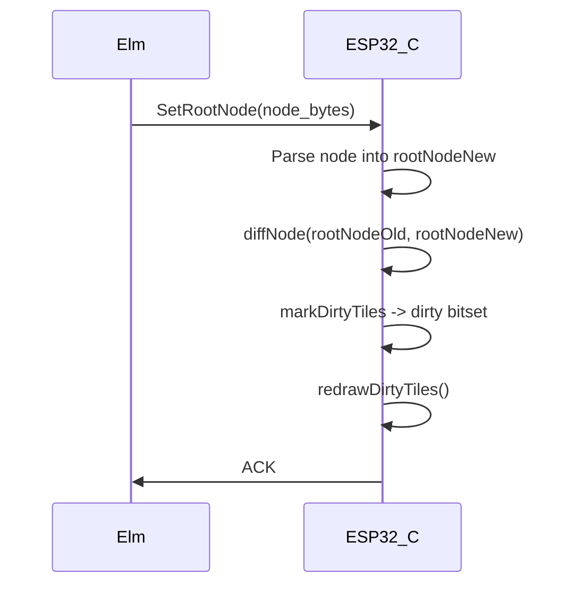
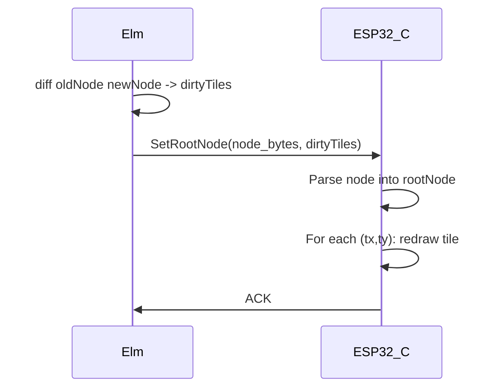

# Move Node Diffing from C to Elm

## Current Architecture

C holds both `rootNodeOld` and `rootNodeNew`, diffs them, computes dirty tiles, then redraws. Elm is stateless w.r.t. the old scene.

## New Architecture

Elm holds `oldRootNode` in its model, diffs against the new one, and sends the resulting dirty tile coordinates alongside the node. C only parses the node and redraws the tiles it's told about.

## Tile Grid Constants

Elm must **not** hardcode tile grid values. The **GetESP32Data** response includes only `tileSize` (C sends it; from [dirty.h](vdom/dirty.h) `TILE_SIZE=8`). Elm derives `tileCols` and `tileRows` from `videoWidth`, `videoHeight`, and decoded `tileSize`, and they live in `VideoConstants`. Tile coords are `(tx, ty)` where `0 <= tx < tileCols`, `0 <= ty < tileRows`.

## Wire Format Change for SetRootNode

Current: `[cmd_tag=1][node_bytes]`

New: `[cmd_tag=1][node_bytes][u16le dirty_count][(u8 tx, u8 ty) * dirty_count]`

The dirty tile list is appended after the node. Each tile is 2 bytes (tx, ty as u8). Max 1500 tiles = 3000 bytes, well within serial budget. The u16le count prefix lets C know how many pairs to read.

**Node bytes (Elm → C):** Each node is `[type u8]` then type-specific payload. **No key or hash** on the wire; they are Elm-only. Elm's encoder omits key; C's `Node` struct and `node_read` have no key or hash.

## C-Side Changes

### [vdom.ino](vdom/vdom.ino)

- **Remove** `rootNodeOld` pointer and the double-buffer pool scheme. Only one pool needed now.
- **Remove** `diffNode()`, `diffChildren()`, `markDirtyTiles()`, and `onNewRootNode()`. With the new approach there is no separate “on new root” step — the handler does parse, set root, and redraw tiles in one place; `onNewRootNode()` is not used.
- **Rename** `rootNodeNew` to `rootNode`.
- **Change** `CMD_SET_ROOT_NODE` handler: parse node; set `rootNode = parsedNode`; read `u16le dirty_count`; then for each of `dirty_count` tiles: read `(tx, ty)` and redraw that tile immediately (clear the tile with `fillRect`, then `drawTile(tx, ty)`). No dirty array: we never build a bitset, just process the stream and redraw as we go.
- **Change** `setup()`: Initialize with a single empty root as `rootNode` (C's `Node` has no key/hash; use whatever constructor matches the trimmed struct). No `onNewRootNode()` call (nothing to draw yet — the empty node has no visual). Elm assumes the same initial state.

### GetESP32Data payload (C and ESP32.elm)

- **Extend** the response to include `tileSize` only (u8 or u16). C writes `TILE_SIZE` from [dirty.h](vdom/dirty.h) (e.g. after existing fields, before the font list). Elm's `ESP32.decoder` decodes `tileSize` and the `ESP32` type includes it. Elm then computes `tileCols` and `tileRows` and stores them in `VideoConstants` (e.g. `tileCols = videoWidth // tileSize`, `tileRows = videoHeight // tileSize`). No `tileCols`/`tileRows` on the wire.

### [node.h](vdom/node.h) and node wire format

- **Remove** `key` and `hash` from the C `Node` struct; they are Elm-only and not sent. **Remove** the key byte from the serial format: `node_read` reads only `type` (u8) then type-specific payload (no key after type). Adjust all `nodeGroup`, `nodeRect`, etc. constructors to not take or set key/hash; use a single empty-root constructor for setup.

### [dirty.h](vdom/dirty.h) — remove dirty array

- **Remove** the whole dirty bitset machinery: the `dirty[]` array, `dirty_clear()`, `dirty_mark()`, `dirty_get()`, `dirty_foreach()`, `dirty_any()`, and all diffing helpers (`dirty_mark_bbox`, `dirty_mark_char_cell`, `dirty_mark_text_diff`). Keep only what’s needed to redraw a single tile: the constants `TILE_SIZE`, `TILE_COLS`, `TILE_ROWS` (used by `drawTile` and by the clear rect). So either reduce dirty.h to just these constants and the tile math used in vdom.ino, or move the constants to constants.h and delete dirty.h if nothing else remains.

## Elm-Side Changes

### New module: [FNV1a.elm](vdom/elm/FNV1a.elm)

- Port **logic** from C [hash.h](vdom/hash.h) (FNV-1a: `hash_init` 2166136261, `hash_step(h, b) = (h ^ b) * 16777619`; keep 32-bit semantics in Elm via masking). Use **style** from [ExampleFnv1a.elm](vdom/elm/ExampleFnv1a.elm) (e.g. `initialSeed`, `hashWithSeed`, module docs).
- **ASCII strings only**: no Utf32/Utf8; only char codes 32..126, one byte per character (fold over string, feed `Char.toCode` into the step).
- **Also hash integers**: expose `updateInt8 : Int -> Int -> Int`, `updateInt16 : Int -> Int -> Int`, `updateInt32 : Int -> Int -> Int` (signed; feed bytes in little-endian order to match C's `hash_update_u32` etc.). Used by the Elm diff to build node hashes.

### New module: [BoundingBox.elm](vdom/elm/BoundingBox.elm)

- `module BoundingBox exposing (BoundingBox)`.
- `type alias BoundingBox = { x : Int, y : Int, w : Int, h : Int }` (mirrors C's bbox in [bbox.h](vdom/bbox.h)). Used by Dirty.elm and Node.elm for bbox computation.

### New module: Dirty.elm

Port the diffing logic. Needs:

- Import `BoundingBox` from `BoundingBox` module.
- **No hardcoded tile grid.** All tile math takes a `TileGrid` (e.g. `tileSize`, `tileCols`, `tileRows`). These come from `VideoConstants`: `tileSize` from `ESP32`, `tileCols` and `tileRows` live in `VideoConstants`.
- `type alias DirtyTiles = Set (Int, Int)` -- set of `(tx, ty)`.
- `diff : TileGrid -> List Font -> Node -> Node -> DirtyTiles` -- main entry; uses tile grid to clamp/validate tile coords.
- `markBbox : TileGrid -> BoundingBox -> DirtyTiles` -- marks all tiles overlapping a bbox (uses tileCols/tileRows for bounds).
- `markTextDiff : ...` -- character-level text diff (mirrors `dirty_mark_text_diff`).
- `dirtyTilesEncoder : DirtyTiles -> Bytes.Encode.Encoder` -- encodes as `[u16le count][(u8 tx, u8 ty)*]`.

### [Node.elm](vdom/elm/Node.elm)

- `**Node.key` is String** (not Int). Key and hash are Elm-only; encoder **omits key** (and does not send hash) so the wire format has no key/hash.
- Add `nodeBbox : List Font -> Node -> BoundingBox.BoundingBox` (import BoundingBox from [BoundingBox.elm](vdom/elm/BoundingBox.elm)). Mirrors C's per-node bbox computation; needed for the diff to know which tiles to mark. Compute bbox on the fly during diff.

### [Command.elm](vdom/elm/Command.elm)

- `SetRootNode` changes from `SetRootNode Node` to `SetRootNode Node DirtyTiles` (or the encoder takes both).
- Encoder appends the dirty tiles after the node bytes.

### [Main.elm](vdom/elm/Main.elm)

- Add `rootNode : Node` to `ModelConnected` (the "old" node, initially `nodeEmpty ""` matching C's empty root).
- On `SetTextarea` (or any scene change):
  1. Compute new node.
  2. Diff `model.rootNode` vs new node -> dirty tiles.
  3. Send `SetRootNode newNode dirtyTiles`.
  4. Update `model.rootNode = newNode`.
- `nodeEmpty` helper: e.g. `Node "" (Group { children = [] })`.

### [ESP32.elm](vdom/elm/ESP32.elm)

- **Decode** `tileSize` from the GetESP32Data payload and add it to the `ESP32` type. In `videoConstants`, extend `VideoConstants` with `tileCols` and `tileRows` (computed from `videoWidth`, `videoHeight`, `tileSize`). Elm uses only these values for diffing and tile encoding; no hardcoded tile grid in Elm source.

## Key Design Decisions

- **Key and hash are Elm-only**: In Elm, `Node.key` is a **String** (not Int). Elm computes a hash and uses it in the diff for short-circuiting unchanged subtrees. **No external FNV1a dependency**: port the C logic from [hash.h](vdom/hash.h) into [elm/FNV1a.elm](vdom/elm/FNV1a.elm), using the style of [ExampleFnv1a.elm](vdom/elm/ExampleFnv1a.elm) (e.g. `initialSeed`, `hashWithSeed`). FNV1a.elm: **ASCII strings only** (char codes 32..126, one byte per char; no Utf32/Utf8). Also expose hashing for **Int8, Int16, Int32** (signed), not just strings. Key and hash are **not sent over the wire**. The C side does not need them: the C `Node` struct has no `key` or `hash` fields, and `node_read` does not read a key byte. The wire format for nodes is: `[type u8]` then type-specific payload (no key, no hash).
- **Font data needed for text bbox and text diff**: The diff needs font metrics (glyphW, glyphH, extraLineHeight) to compute text bounding boxes and do character-level text diffing. Pass `List Font` (from `ESP32`) into the diff function.
- **Initial state**: Both C and Elm start with an empty root (e.g. `nodeEmpty ""` in Elm = group with key `""` and no children). First real scene will diff against this empty node, marking the new scene's bbox as dirty.

